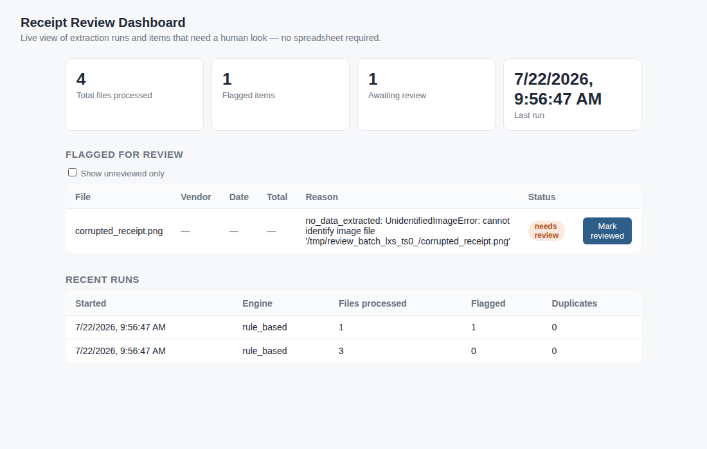
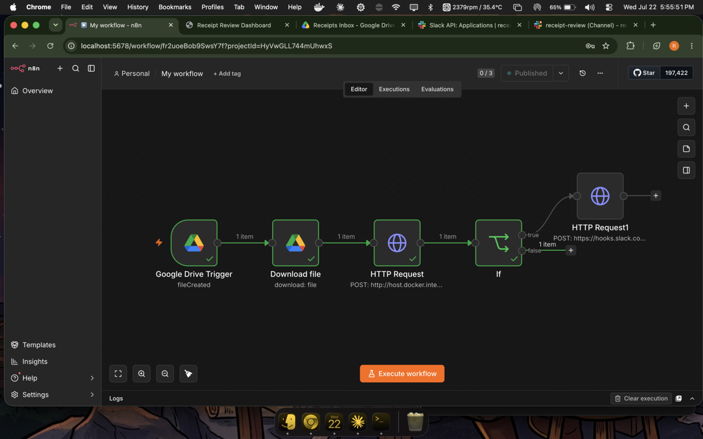
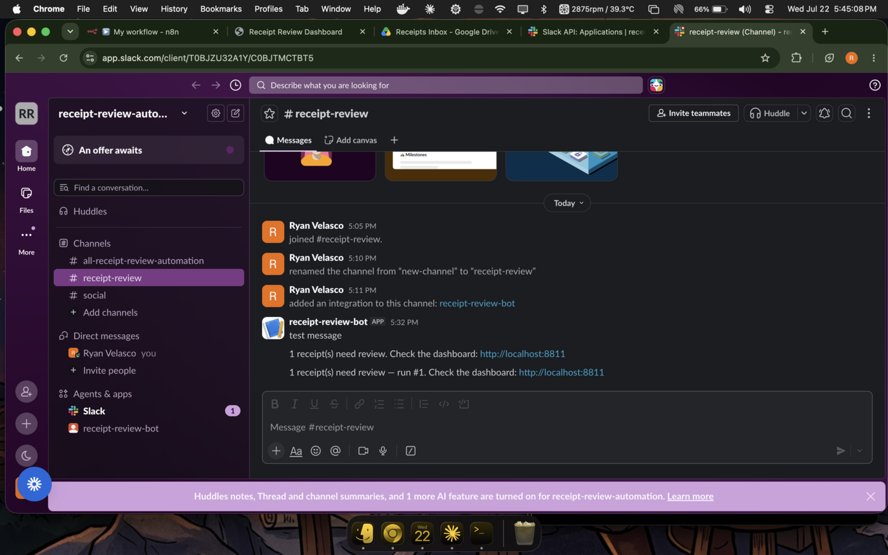

# Receipt Review Automation

*By Ryan Velasco — a no-code/low-code automation layer built on top of
[receipt-invoice-extractor](https://github.com/sozinscomment/receipt-invoice-extractor),
demonstrating end-to-end workflow orchestration (n8n), API design, and
human-in-the-loop review for an AI extraction pipeline.*

**Status: complete and verified end-to-end**, running live on Google Drive,
a self-hosted n8n instance, and Slack.

## What this is

The receipt-invoice-extractor project processes receipts but leaves a human
to run it manually and dig through a spreadsheet for anything that went
wrong. This project closes that gap:

1. **Input** — a synced Google Drive folder ("Receipts Inbox") that receipt
   images/PDFs land in.
2. **Transformation** — every 15 minutes, an n8n workflow checks the folder
   for new files, downloads any it finds, and sends them to a small FastAPI
   wrapper around the extractor pipeline. The wrapper processes them and
   flags anything that failed to read, was a duplicate, or produced no
   usable data at all.
3. **Output** — a review dashboard (browse every run, see flagged items,
   mark them reviewed with one click) and a Slack notification, sent to a
   `#receipt-review` channel only when something actually needs a human's
   attention.

## Architecture

```
Google Drive ("Receipts Inbox")
        │  n8n: scheduled trigger, every 15 min
        ▼
Google Drive Trigger ──▶ Download file ──▶ HTTP Request ──▶ FastAPI /process
                                                    │              │
                                                    │              ▼
                                                    │        extractor pipeline
                                                    │        (rule_based / ai_vision)
                                                    │              │
                                                    │              ▼
                                                    │    SQLite (runs + flagged items)
                                                    │              │
                                                    │              ▼
                                                    │     Dashboard (localhost:8811)
                                                    ▼
                                              If flagged_count > 0
                                                    │
                                                    ▼
                                          Slack: #receipt-review
```

Every arrow in this diagram is a real, tested connection — not a planned
one. See "Proof it works," below.

## Proof it works

Built and tested against real Google Drive, a self-hosted n8n instance
(Docker), and a real Slack workspace — not just local unit tests:

- A file dropped into the Drive "Receipts Inbox" folder is picked up by
  n8n's scheduled trigger, downloaded, and POSTed to the API.
- A receipt the extractor can't read (or a duplicate) is correctly flagged,
  shows up in the dashboard with the exact reason, and triggers a Slack
  message in `#receipt-review`.
- A clean, readable receipt processes silently — no flagged item, no Slack
  message — confirming the notification-only-when-needed logic actually
  holds both ways, not just on the "happy path."







The actual n8n workflow (the real one that produced the proof above) is
exported and included at
[`docs/n8n_workflow/receipt_review_workflow.json`](docs/n8n_workflow/receipt_review_workflow.json),
with the Slack webhook URL, Drive folder ID, and instance-specific
credential IDs redacted — see
[`docs/n8n_workflow/README.md`](docs/n8n_workflow/README.md) for what was
redacted and how to import it into your own n8n instance.
`docs/N8N_SETUP.md` covers the full setup (Docker, n8n, Google Drive,
Slack) this workflow was built against.

## Running it locally

```bash
python3 -m venv venv
source venv/bin/activate
pip install -r requirements.txt
cp .env.example .env   # optional — only needed to enable the ai_vision engine
uvicorn api.main:app --host 0.0.0.0 --port 8811
```

Open http://localhost:8811 for the dashboard. See `docs/N8N_SETUP.md` for
the full Docker + n8n + Google Drive + Slack setup that drives it — that
guide reflects the actual steps used to get this running, including a
couple of real gotchas (a Google OAuth consent-screen test-user requirement,
and an n8n JSON body field that silently broke from a smart-quote
character during copy-paste).

## Tests

```bash
python -m pytest tests/ -q
```

15 automated tests covering storage CRUD, the processing pipeline (clean
receipts, duplicates, unreadable files), and every API route.

## Project layout

- `api/` — FastAPI app (`main.py`), the processing bridge (`processor.py`),
  SQLite storage (`storage.py`), and the single-page dashboard
  (`dashboard/index.html`).
- `extractor/` — vendored copy of the receipt-invoice-extractor pipeline
  (kept in sync manually; see that project for its own docs/tests).
- `tests/` — pytest suite.
- `docs/` — setup guide and dashboard screenshot.

## Design notes / known limitations

- Duplicate detection only compares files within a single processing batch,
  matching the underlying extractor's behavior — it does not yet check
  against every file ever processed. A production version would persist
  content hashes across runs to catch duplicates submitted days apart.
- This demo runs n8n and the API locally on one machine for development and
  testing. A real deployment for a distributed team of human validators
  would run both on an always-on host (a small cloud VM, or n8n's hosted
  cloud tier) rather than depending on a laptop staying open.
- No authentication on the dashboard or API — acceptable for a local/demo
  setup, not for a multi-user production deployment.

## License

MIT — see the [receipt-invoice-extractor](https://github.com/sozinscomment/receipt-invoice-extractor)
repo for the license text (to be added directly here once this project is
published as its own repo).
